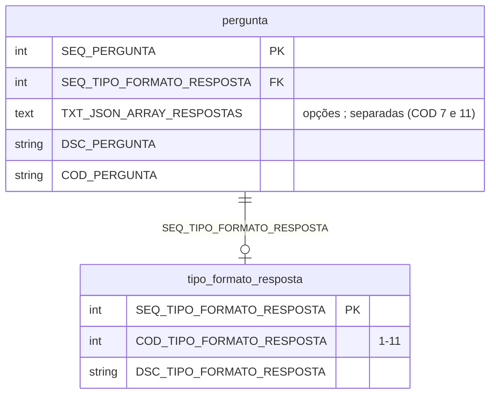
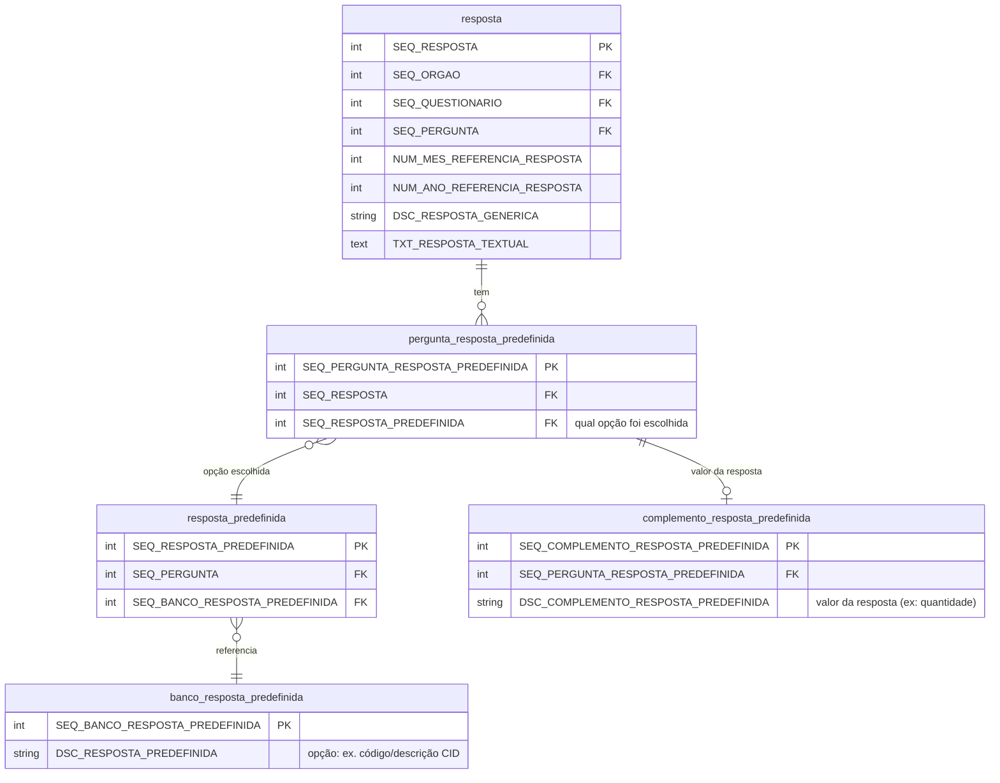
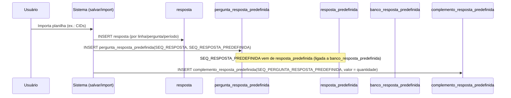
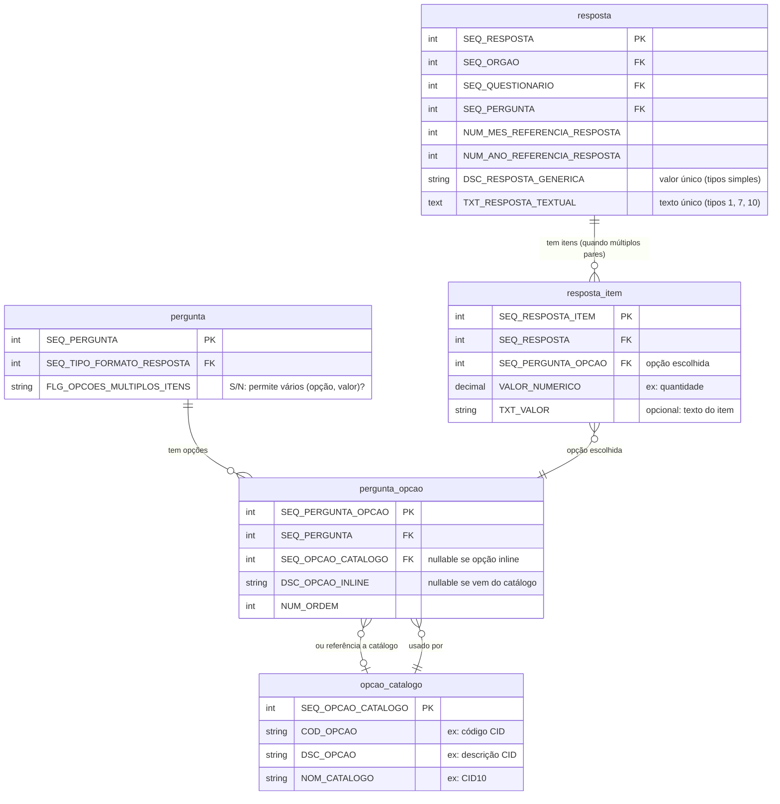
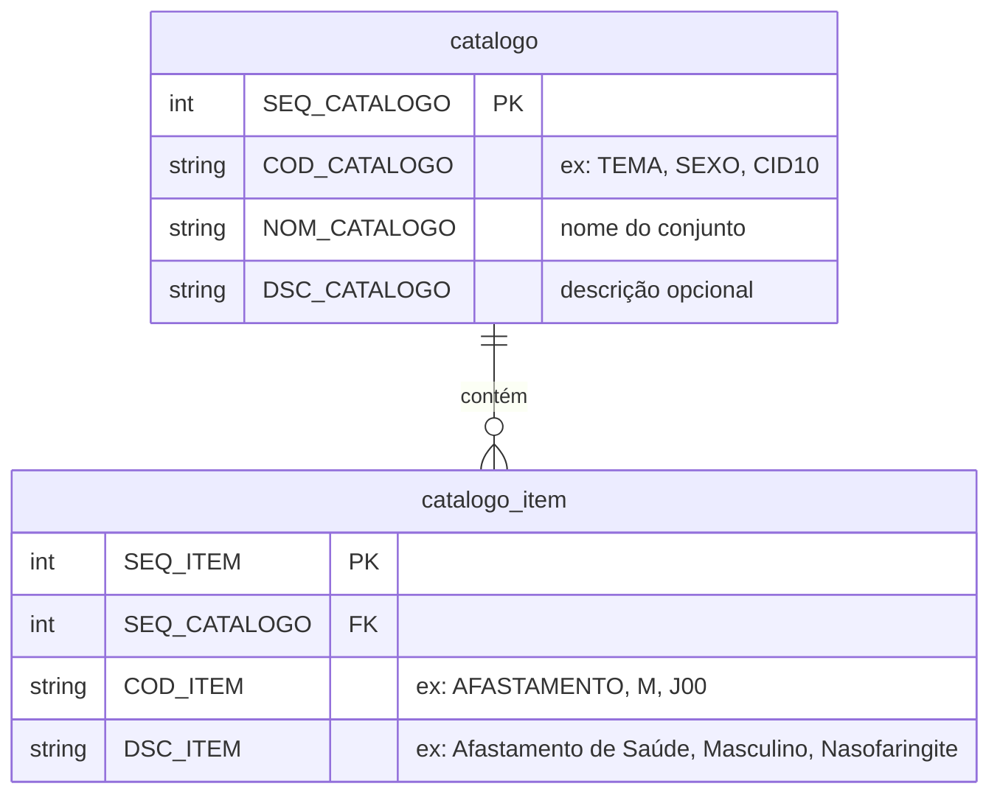
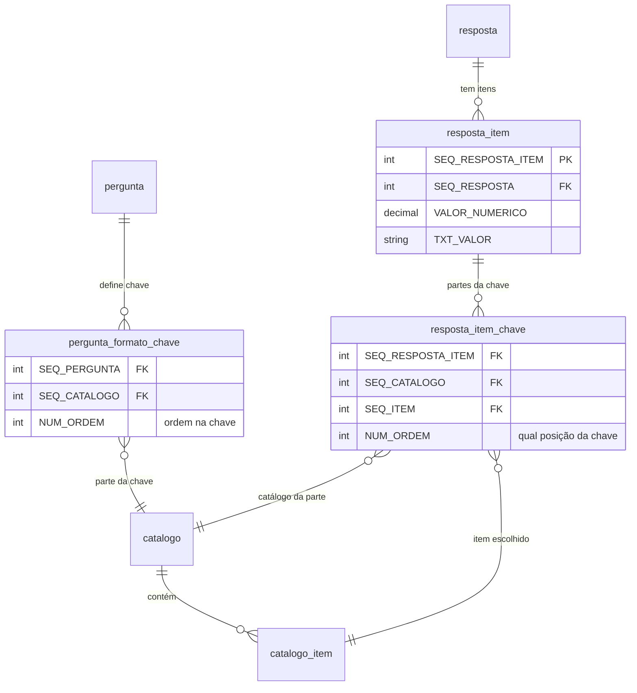

# Documentação de negócio: perguntas com respostas pré-definidas e estruturas de banco

Este documento descreve como funcionam as **perguntas com respostas pré-definidas** no sistema de questionários: tipos de formato de resposta, onde as opções são armazenadas e como são usadas na gravação e na exibição. Inclui diagramas (Mermaid) e consultas SQL de exemplo para validação.

---

## 1. Visão geral

O sistema trata **dois mecanismos** de “respostas pré-definidas”:

1. **Opções na própria pergunta**  
   Lista de opções fixas armazenada no campo `TXT_JSON_ARRAY_RESPOSTAS` da tabela `pergunta` (formato texto com separador `;`). Usado para **escolha múltipla (checkbox)** e **lista para escolha única (radio)**.

2. **Respostas pré-definidas vinculadas a banco (CID / Saúde)**  
   Estrutura de tabelas (`banco_resposta_predefinida`, `resposta_predefinida`, `pergunta_resposta_predefinida`, `complemento_resposta_predefinida`) usada no **questionário 3** (Saúde). Na prática, **`DSC_RESPOSTA_PREDEFINIDA`** identifica a **opção escolhida** (ex.: CID) e **`DSC_COMPLEMENTO_RESPOSTA_PREDEFINIDA`** armazena o **valor da resposta** (ex.: quantidade), e não um “complemento” opcional.

Abaixo: tipos de formato, estruturas de banco, exemplos, a **proposta de modelo unificado** (Seção 9) e uma **análise das perguntas do questionário Saúde** (Seção 10). A Seção 10 descreve o problema atual (muitas perguntas = combinações de dimensões) e propõe que o sistema trate os dados de forma **genérica**: **cadastro genérico de catálogos** (tema, sexo, faixa etária, CID etc. como itens de catálogos), **formato de resposta chave-valor** em que a chave é definida por **um catálogo ou pela combinação de vários catálogos**, e poucas perguntas “modelo” cuja resposta é um conjunto de (chave, valor). Assim não é necessário pré-preencher todas as combinações como perguntas distintas.

---

## 2. Tipos de formato de resposta (`tipo_formato_resposta`)

Cada pergunta possui um **tipo de formato de resposta** (`SEQ_TIPO_FORMATO_RESPOSTA` / `COD_TIPO_FORMATO_RESPOSTA`), que define como a pergunta é exibida e onde o valor é armazenado.

### 2.1. Tabela de domínio

| COD | Nome (DSC_TIPO_FORMATO_RESPOSTA) | Interface | Usa opções pré-definidas? | Onde ficam as opções |
|-----|----------------------------------|-----------|----------------------------|----------------------|
| 1   | Texto                            | Textarea  | Não                        | —                    |
| 2   | Valor/Moeda                      | Input R$  | Não                        | —                    |
| 4   | Sim/Não                          | Radio Sim/Não fixo | Sim (fixas no código) | —                    |
| 5   | Número                           | Input numérico | Não                  | —                    |
| 7   | Múltipla escolha (checkbox)      | Vários checkboxes | Sim                  | `pergunta.TXT_JSON_ARRAY_RESPOSTAS` |
| 8   | Número inteiro                   | Input inteiro | Não                   | —                    |
| 9   | Upload                           | Upload de arquivo | Não                   | —                    |
| 10  | Sim/Não com texto (resposta)     | Radio Sim/Não + textarea | Sim (Sim/Não fixas) | —                    |
| 11  | Lista para escolha única         | Radio com lista | Sim                    | `pergunta.TXT_JSON_ARRAY_RESPOSTAS` |

### 2.2. Diagrama: pergunta e tipo de formato



---

## 3. Opções na pergunta: `TXT_JSON_ARRAY_RESPOSTAS`

### 3.1. Estrutura

- **Tabela:** `pergunta`
- **Campo:** `TXT_JSON_ARRAY_RESPOSTAS` (TEXT, nullable)
- **Formato:** lista de opções em texto, separadas por **ponto e vírgula** (`;`).  
  O nome “JSON” é histórico; na prática não é JSON, e sim uma string delimitada.

### 3.2. Uso no código

- **Backend (QuestionarioModel):** ao montar as perguntas para o front, o valor é quebrado em array com `explode(';', ...)` e enviado como `jsonArrayRespostas`.
- **Frontend (questionario-responder.phtml):**
  - **COD 7 (múltipla escolha):** `ng-repeat="jsondata in oq.jsonArrayRespostas"` → um checkbox por opção; o valor salvo é a concatenação dos itens marcados (tratado como texto).
  - **COD 11 (escolha única):** mesmo array → um radio por opção; o valor salvo é a opção selecionada.

### 3.3. Onde o valor é gravado

Na tabela **`resposta`**:

- Para tipos que usam “valor genérico” (ex.: 4, 5, 7, 8, 11): `DSC_RESPOSTA_GENERICA`.
- Para texto livre ou texto adicional (1, 7, 10): `TXT_RESPOSTA_TEXTUAL`.  
  No tipo 10, `DSC_RESPOSTA_GENERICA` guarda “Sim”/“Não” e `TXT_RESPOSTA_TEXTUAL` o complemento.

### 3.4. Consultas SQL de exemplo

**Listar perguntas que têm opções pré-definidas (TXT_JSON_ARRAY_RESPOSTAS preenchido):**

```sql
-- Perguntas com lista de opções (checkbox ou lista única)
SELECT
    p.SEQ_PERGUNTA,
    p.COD_PERGUNTA,
    p.DSC_PERGUNTA,
    tfr.COD_TIPO_FORMATO_RESPOSTA,
    tfr.DSC_TIPO_FORMATO_RESPOSTA,
    p.TXT_JSON_ARRAY_RESPOSTAS
FROM questionario_sustentavel_dpj.pergunta p
JOIN questionario_sustentavel_dpj.tipo_formato_resposta tfr
    ON tfr.SEQ_TIPO_FORMATO_RESPOSTA = p.SEQ_TIPO_FORMATO_RESPOSTA
WHERE p.TXT_JSON_ARRAY_RESPOSTAS IS NOT NULL
  AND TRIM(p.TXT_JSON_ARRAY_RESPOSTAS) != '';
```

**Contar perguntas por tipo de formato:**

```sql
SELECT
    tfr.COD_TIPO_FORMATO_RESPOSTA,
    tfr.DSC_TIPO_FORMATO_RESPOSTA,
    COUNT(p.SEQ_PERGUNTA) AS qtd_perguntas
FROM questionario_sustentavel_dpj.pergunta p
JOIN questionario_sustentavel_dpj.tipo_formato_resposta tfr
    ON tfr.SEQ_TIPO_FORMATO_RESPOSTA = p.SEQ_TIPO_FORMATO_RESPOSTA
WHERE p.FLG_ATIVA = 'S'
GROUP BY tfr.SEQ_TIPO_FORMATO_RESPOSTA, tfr.COD_TIPO_FORMATO_RESPOSTA, tfr.DSC_TIPO_FORMATO_RESPOSTA
ORDER BY tfr.COD_TIPO_FORMATO_RESPOSTA;
```

---

## 4. Respostas pré-definidas do questionário Saúde (CID)

Usado no **questionário 3** (Saúde): o usuário importa uma planilha; o sistema grava **uma linha de resposta** para cada par (opção escolhida, valor). Cada linha associa uma opção do catálogo (ex.: CID) ao **valor da resposta** (ex.: quantidade de ocorrências).

### 4.1. Papel real dos campos na consulta de “complementos”

Na prática, a consulta de complementos retorna **o valor da resposta**, e não um “complemento” opcional:

| Coluna no retorno | Significado real |
|-------------------|------------------|
| `DSC_RESPOSTA_PREDEFINIDA` | **Opção escolhida** — identificador/descrição da resposta pré-definida (ex.: código CID + descrição: "Z54 - Convalescença", "J00 - Nasofaringite aguda"). |
| `DSC_COMPLEMENTO_RESPOSTA_PREDEFINIDA` | **Valor da resposta** — quantidade ou valor numérico associado àquela opção (ex.: "2", "1"). Não é um texto complementar; é o dado que responde “quanto?” para aquela opção. |

**Exemplo de retorno (questionário 3 – Saúde):**

| NUM_ANO_REFERENCIA_RESPOSTA | NUM_MES_REFERENCIA_RESPOSTA | SEQ_ORGAO | SEQ_PERGUNTA | DSC_PERGUNTA | DSC_RESPOSTA_PREDEFINIDA (opção) | DSC_COMPLEMENTO_RESPOSTA_PREDEFINIDA (valor) |
|-----------------------------|-----------------------------|--------|--------------|--------------|-----------------------------------|----------------------------------------------|
| 2024 | 1 | 18 | 367 | 1- Afastamento de Saúde - Magistrados / ... | Z54 - Convalescença | 2 |
| 2024 | 1 | 18 | 367 | 1- Afastamento de Saúde - Magistrados / ... | J00 - Nasofaringite aguda [resfriado comum] | 1 |
| 2024 | 1 | 18 | 367 | 1- Afastamento de Saúde - Magistrados / ... | B34 - Doenças por vírus | 1 |

Ou seja: para a mesma pergunta (367), órgão 18 e período 01/2024, há **vários pares (opção, valor)** — cada linha é uma opção (CID) com seu valor (quantidade). O nome “complemento” no modelo atual designa, na verdade, **o valor da resposta** àquela opção.

### 4.2. Tabelas envolvidas (estrutura atual)

| Tabela | Função |
|--------|--------|
| `banco_resposta_predefinida` | Catálogo de opções (ex.: códigos CID e descrições). |
| `resposta_predefinida` | Vínculo pergunta ↔ opção do catálogo (quais CIDs podem ser usados naquela pergunta). |
| `resposta` | Uma linha por **(órgão, questionário, pergunta, período)** para cada par (opção, valor) — no fluxo Saúde há várias linhas em `resposta` para a mesma pergunta/período. |
| `pergunta_resposta_predefinida` | Associa cada registro de **resposta** à **opção** escolhida (qual CID). |
| `complemento_resposta_predefinida` | Armazena o **valor da resposta** (ex.: quantidade) para aquela opção. O nome sugere “complemento”, mas na prática é o valor principal (quantidade/numérico). |

### 4.3. Diagrama ER – respostas pré-definidas (Saúde/CID) – estrutura atual



### 4.4. Fluxo de uso (importação planilha – questionário 3)



### 4.5. Consulta dos complementos (respostas importadas)

A tela “Respostas importadas” usa a consulta que junta **resposta → pergunta_resposta_predefinida → complemento_resposta_predefinida → resposta_predefinida → banco_resposta_predefinida** para exibir pergunta, **opção escolhida** (ex.: CID em `DSC_RESPOSTA_PREDEFINIDA`) e **valor da resposta** (ex.: quantidade em `DSC_COMPLEMENTO_RESPOSTA_PREDEFINIDA`):

```sql
-- Exemplo: listar respostas com pré-definidas e complemento (ajustar filtros)
SELECT
    r.SEQ_PERGUNTA,
    p.DSC_PERGUNTA,
    p.DSC_COMPLEMENTO_PERGUNTA,
    brp.DSC_RESPOSTA_PREDEFINIDA,
    crp.DSC_COMPLEMENTO_RESPOSTA_PREDEFINIDA
FROM questionario_sustentavel_dpj.resposta r
JOIN questionario_sustentavel_dpj.pergunta_resposta_predefinida prp
    ON prp.SEQ_RESPOSTA = r.SEQ_RESPOSTA
JOIN questionario_sustentavel_dpj.complemento_resposta_predefinida crp
    ON crp.SEQ_PERGUNTA_RESPOSTA_PREDEFINIDA = prp.SEQ_PERGUNTA_RESPOSTA_PREDEFINIDA
JOIN questionario_sustentavel_dpj.resposta_predefinida rp
    ON rp.SEQ_RESPOSTA_PREDEFINIDA = prp.SEQ_RESPOSTA_PREDEFINIDA
JOIN questionario_sustentavel_dpj.banco_resposta_predefinida brp
    ON brp.SEQ_BANCO_RESPOSTA_PREDEFINIDA = rp.SEQ_BANCO_RESPOSTA_PREDEFINIDA
JOIN questionario_sustentavel_dpj.pergunta p
    ON p.SEQ_PERGUNTA = r.SEQ_PERGUNTA
WHERE r.SEQ_ORGAO = :seqOrgao
  AND r.SEQ_QUESTIONARIO = 3
  AND r.NUM_MES_REFERENCIA_RESPOSTA = :mes
  AND r.NUM_ANO_REFERENCIA_RESPOSTA = :ano
ORDER BY p.SEQ_PERGUNTA;
```

Substitua `:seqOrgao`, `:mes` e `:ano` por valores reais para testar.

### 4.6. Verificar existência de dados no “banco” de pré-definidas

```sql
-- Quantos itens existem no banco de respostas pré-definidas
SELECT COUNT(*) AS total FROM questionario_sustentavel_dpj.banco_resposta_predefinida;

-- Amostra de itens do banco
SELECT SEQ_BANCO_RESPOSTA_PREDEFINIDA, DSC_RESPOSTA_PREDEFINIDA
FROM questionario_sustentavel_dpj.banco_resposta_predefinida
LIMIT 20;

-- Respostas pré-definidas vinculadas a perguntas (ex.: questionário 3)
SELECT
    rp.SEQ_RESPOSTA_PREDEFINIDA,
    rp.SEQ_PERGUNTA,
    p.COD_PERGUNTA,
    brp.DSC_RESPOSTA_PREDEFINIDA
FROM questionario_sustentavel_dpj.resposta_predefinida rp
JOIN questionario_sustentavel_dpj.banco_resposta_predefinida brp
    ON brp.SEQ_BANCO_RESPOSTA_PREDEFINIDA = rp.SEQ_BANCO_RESPOSTA_PREDEFINIDA
JOIN questionario_sustentavel_dpj.pergunta p
    ON p.SEQ_PERGUNTA = rp.SEQ_PERGUNTA
LIMIT 30;
```

---

## 5. Onde a resposta é armazenada (`resposta`)

Toda resposta do usuário (seja valor livre, opção da lista ou vínculo com pré-definida) gera ou atualiza registro na tabela **`resposta`**:

| Campo | Uso principal |
|-------|----------------|
| `SEQ_RESPOSTA` | PK. |
| `SEQ_ORGAO`, `SEQ_QUESTIONARIO`, `SEQ_PERGUNTA` | Contexto: qual órgão, questionário e pergunta. |
| `NUM_MES_REFERENCIA_RESPOSTA`, `NUM_ANO_REFERENCIA_RESPOSTA` | Período de referência. |
| `DSC_RESPOSTA_GENERICA` | Valor “genérico”: número, Sim/Não, opção única, ou "N/A" quando “Não se aplica”. Para tipos 7 (múltipla), o valor pode ser tratado como texto no front e gravado em `TXT_RESPOSTA_TEXTUAL` conforme implementação. |
| `TXT_RESPOSTA_TEXTUAL` | Texto livre ou texto complementar (ex.: tipo 1, tipo 10). |
| `USU_INCLUSAO_RESPOSTA`, `DAT_INCLUSAO_RESPOSTA` | Auditoria. |

Quando a resposta participa do fluxo de **respostas pré-definidas** (Saúde), o mesmo `SEQ_RESPOSTA` é referenciado em **`pergunta_resposta_predefinida`** (indicando **qual opção** foi escolhida) e em **`complemento_resposta_predefinida`** (indicando o **valor** da resposta, ex.: quantidade). Ou seja: “complemento” no modelo atual é o valor principal (ex.: quantidade), não um texto opcional.

---

## 6. Diagrama geral: pergunta → formato → resposta

```mermaid
flowchart LR
    subgraph Pergunta
        P[pergunta]
        TFR[tipo_formato_resposta]
        P -->|SEQ_TIPO_FORMATO_RESPOSTA| TFR
        P --> TXT["TXT_JSON_ARRAY_RESPOSTAS (opções ;)"]
    end

    subgraph Resposta do usuário
        R[resposta]
        R --> DSC["DSC_RESPOSTA_GENERICA"]
        R --> TXT_R["TXT_RESPOSTA_TEXTUAL"]
    end

    subgraph Pré-definidas (Saúde)
        PRP[pergunta_resposta_predefinida]
        RP[resposta_predefinida]
        BRP[banco_resposta_predefinida]
        CRP[complemento_resposta_predefinida]
        R --> PRP
        PRP --> RP
        RP --> BRP
        PRP --> CRP
    end

    P --> R
```

---

## 7. Casos de exemplo resumidos

| Caso | Tipo (COD) | Onde estão as opções | Onde é gravado o valor |
|------|------------|------------------------|-------------------------|
| Texto livre | 1 | — | `resposta.TXT_RESPOSTA_TEXTUAL` |
| Valor em R$ | 2 | — | `resposta.DSC_RESPOSTA_GENERICA` |
| Sim/Não | 4 | Fixas no HTML (Sim/Não) | `resposta.DSC_RESPOSTA_GENERICA` |
| Número | 5 | — | `resposta.DSC_RESPOSTA_GENERICA` |
| Múltipla escolha (checkbox) | 7 | `pergunta.TXT_JSON_ARRAY_RESPOSTAS` (`;`) | `resposta.TXT_RESPOSTA_TEXTUAL` (valores selecionados) |
| Lista escolha única (radio) | 11 | `pergunta.TXT_JSON_ARRAY_RESPOSTAS` (`;`) | `resposta.DSC_RESPOSTA_GENERICA` |
| Sim/Não + texto | 10 | Sim/Não fixas | `DSC_RESPOSTA_GENERICA` = Sim/Não; `TXT_RESPOSTA_TEXTUAL` = texto |
| Importação planilha (Saúde) | — | `banco_resposta_predefinida` (opções) | Uma linha `resposta` por par (opção, valor); opção em `pergunta_resposta_predefinida`→`resposta_predefinida`; **valor** (ex.: quantidade) em `complemento_resposta_predefinida.DSC_COMPLEMENTO_RESPOSTA_PREDEFINIDA` |

---

## 8. Referência de código

- **Carregamento de perguntas e opções:** `QuestionarioModel::findQuestionarioPergunta()` — monta `jsonArrayRespostas` a partir de `TXT_JSON_ARRAY_RESPOSTAS`.
- **Salvamento de respostas “normais”:** `QuestionarioModel::salvarRespostasPerguntas()` — grava em `resposta` (e, para tipo 10, usa `respostaCheck` + texto).
- **Respostas pré-definidas (Saúde):** `RespostaModel::consultarComplementosReposta()` (leitura); `salvar.php` (importação) — insere em `resposta`, `pergunta_resposta_predefinida` e `complemento_resposta_predefinida`.
- **Exibição por tipo:** `questionario-responder.phtml` — `ng-switch="oq.codTipoFormatoResposta"` (valores 2, 4, 5, 7, 8, 9, 10, 11; tipo 1 no default).

---

## 9. Proposta de modelo unificado (opções e respostas)

Hoje existem **duas estruturas paralelas** para “opções pré-definidas”:

1. **Opções na pergunta:** `pergunta.TXT_JSON_ARRAY_RESPOSTAS` (texto com `;`) para tipos 7 e 11; valor em `resposta.DSC_RESPOSTA_GENERICA` ou `resposta.TXT_RESPOSTA_TEXTUAL`.
2. **Opções em catálogo (Saúde):** `banco_resposta_predefinida` → `resposta_predefinida` → `pergunta_resposta_predefinida` → `complemento_resposta_predefinida`; uma linha de `resposta` por par (opção, valor).

A proposta abaixo unifica conceitos para **uma única forma** de tratar opções e respostas com múltiplos (opção, valor), sem manter duas trilhas distintas.

### 9.1. Princípios do modelo unificado

- **Uma única origem de opções:** toda pergunta que tem lista de opções referencia um mesmo conceito — seja lista inline (texto na pergunta) ou catálogo (tabela).
- **Uma única forma de gravar “vários pares (opção, valor)”:** em vez de várias linhas em `resposta` + `pergunta_resposta_predefinida` + `complemento_resposta_predefinida`, usar **uma resposta** (container) + **itens de resposta** (cada par opção/valor).
- **Nomes que refletem o uso:** “complemento” vira explicitamente “valor da resposta” (ex.: quantidade).

### 9.2. Modelo proposto (visão lógica)



### 9.3. Papel das entidades

| Entidade | Papel |
|----------|--------|
| **opcao_catalogo** | Catálogos reutilizáveis (ex.: CID-10). Substitui o papel de `banco_resposta_predefinida`. |
| **pergunta_opcao** | Opções disponíveis para uma pergunta: ou referenciam `opcao_catalogo` (catálogo) ou usam `DSC_OPCAO_INLINE` (lista simples, substituindo o uso de `TXT_JSON_ARRAY_RESPOSTAS` para listas estruturadas). |
| **resposta** | Sempre **uma linha** por (órgão, questionário, pergunta, período). Para tipos “valor único”, o valor fica em `DSC_RESPOSTA_GENERICA` ou `TXT_RESPOSTA_TEXTUAL`. |
| **resposta_item** | Quando a pergunta permite **múltiplos pares (opção, valor)** (ex.: Saúde/CID): um item por par (opção escolhida, valor). A “opção” pode ser `SEQ_PERGUNTA_OPCAO` (quando as opções são inline ou vinculadas via pergunta_opcao) ou **SEQ_ITEM do catálogo** (quando a pergunta usa “opções = catálogo”, ex.: UFs — ver 9.3.2). O “valor” fica em `VALOR_NUMERICO` ou `TXT_VALOR` (ou vazio quando só importa “quais opções foram selecionadas”). |

### 9.3.1. Opções inline: quando usar e por que são válidas

**Opções inline** são listas de opções definidas **diretamente na pergunta** (via `pergunta_opcao` com `DSC_OPCAO_INLINE`), sem uso de catálogo. A proposta **mantém e valida** esse mecanismo.

- **Quando faz sentido:** perguntas de múltipla escolha ou escolha única cuja lista é **específica daquela pergunta**, não compartilhada com outras e sem necessidade de reutilização (ex.: “Qual o principal meio de divulgação? — Site; Redes sociais; Impresso; Outro”). Não exige criar catálogo nem burocracia: cadastra-se apenas as linhas em `pergunta_opcao` com o texto de cada opção.
- **Vantagem:** simplicidade. Uma pergunta, uma lista de opções, sem dependência de cadastro de catálogo. Ideal para listas pequenas e de uso único.
- **Resposta:** continua em `resposta` (uma linha) com `DSC_RESPOSTA_GENERICA` (escolha única) ou `TXT_RESPOSTA_TEXTUAL` (múltipla escolha), ou em `resposta_item` (um item por opção selecionada) se o modelo unificado normalizar também esse caso para itens.

Ou seja: **não é obrigatório** usar catálogo para toda pergunta com opções. Catálogo entra quando há **reutilização** ou **conjunto grande/administrável** (ex.: UFs, CIDs). O resto permanece inline, com o mínimo de burocracia.

### 9.3.2. Pergunta cujas opções vêm de um catálogo (ex.: UFs)

Quando as opções da pergunta **são** os itens de um **catálogo já existente** (ex.: UFs, municípios, CIDs), a pergunta não precisa repetir a lista em `pergunta_opcao`: ela **referencia o catálogo** e o sistema passa a tratar “opções disponíveis = itens daquele catálogo”.

**Exemplo:** existe um catálogo **UF** com os 27 itens (AC, AL, …, TO). Uma pergunta pede: *“Selecione uma ou mais UFs em que o programa está em vigor.”*

- **Definição da pergunta:** em vez de criar 27 linhas em `pergunta_opcao`, a pergunta tem um vínculo **“opções = catálogo UF”** (ex.: campo `SEQ_CATALOGO` na pergunta, ou uma tabela `pergunta_opcao_catalogo` com SEQ_PERGUNTA + SEQ_CATALOGO). O tipo de formato continua “múltipla escolha” (ou “escolha única”, se for o caso).
- **Na tela:** o sistema carrega os itens do catálogo UF e exibe como checkboxes (ou lista/radio). O usuário seleciona uma ou mais UFs.
- **Gravação da resposta:** uma linha em `resposta` (órgão, questionário, pergunta, período) e **uma linha em `resposta_item` por UF selecionada**, referenciando o **item do catálogo** (ex.: `SEQ_ITEM` de `catalogo_item`) — não `pergunta_opcao`, pois a opção veio do catálogo. O “valor” do item pode ser nulo ou um indicador (ex.: “selecionado”); o que importa é o conjunto de itens escolhidos.

Assim, **dois modos de definir opções** coexistem:

| Modo | Como se define | Onde fica a resposta (opção escolhida) |
|------|----------------|----------------------------------------|
| **Inline** | `pergunta_opcao` com `DSC_OPCAO_INLINE` (uma linha por opção) | `resposta.DSC_RESPOSTA_GENERICA` ou `TXT_RESPOSTA_TEXTUAL`, ou `resposta_item` → `pergunta_opcao` |
| **Catálogo** | Pergunta referencia um catálogo (ex.: UF); opções = itens desse catálogo | `resposta_item` → `catalogo_item` (SEQ_ITEM); uma linha por opção selecionada |

No caso “UF”, o catálogo já existe (cadastro genérico da Seção 10); a pergunta só diz “minhas opções são os itens do catálogo UF” e a resposta grava quais itens foram selecionados. Nenhuma lista duplicada, nenhuma necessidade de criar “pergunta_opcao” para cada UF.

### 9.4. Compatibilidade com o atual

- **Perguntas com `TXT_JSON_ARRAY_RESPOSTAS` (tipos 7 e 11):** migrar para `pergunta_opcao` com `DSC_OPCAO_INLINE` (uma linha por opção); resposta continua em `resposta` (uma linha) com `DSC_RESPOSTA_GENERICA` ou `TXT_RESPOSTA_TEXTUAL` até que se decida também normalizar para `resposta_item` quando fizer sentido.
- **Questionário 3 (Saúde):** migrar `banco_resposta_predefinida` → `opcao_catalogo`; `resposta_predefinida` + vínculo à pergunta → `pergunta_opcao`; cada linha atual (resposta + pergunta_resposta_predefinida + complemento) → um **resposta** (uma por pergunta/órgão/período, se ainda não existir) + **resposta_item** (opção = ex-CID, valor = ex-quantidade). Assim elimina-se a estrutura paralela e o nome “complemento” deixa de designar o valor da resposta.

### 9.5. Benefícios

- **Um único modelo** para “pergunta com opções” e “resposta com vários (opção, valor)”.
- **Nomenclatura clara:** opção vs. valor da resposta (sem “complemento” ambíguo).
- **Extensível:** novos catálogos e novos tipos de valor (numérico/texto) sem novas tabelas paralelas.
- **Consulta única:** para “respostas importadas” (Saúde), uma query em `resposta` + `resposta_item` + `pergunta_opcao` (+ `opcao_catalogo` quando for catálogo) retorna opção e valor com nomes de coluna explícitos.

---

## 10. Análise das perguntas do questionário Saúde: combinações como “perguntas”

No questionário 3 (Saúde), a lista de **perguntas** exibida ao usuário é na verdade um **conjunto de combinações de dimensões**, cada uma cadastrada como uma pergunta distinta (`SEQ_PERGUNTA` e `DSC_PERGUNTA` diferentes). O conteúdo da pergunta repete um mesmo padrão com variações.

### 10.1. Padrão observado nas descrições

As descrições seguem um esquema do tipo:

```
[Número]- [Tema] / [Tipo de público] / [Sexo] / [Faixa etária] / [Área/grau de atuação]
```

Exemplos reais:

| Número | Tema                 | Tipo      | Sexo     | Faixa etária     | Área/grau                                                    |
|--------|----------------------|-----------|----------|------------------|--------------------------------------------------------------|
| 1      | Afastamento de Saúde | Magistrados | Masculino | De 46 a 55 anos  | Se Magistrado - Atua no 1o Grau de Jurisdição               |
| 2      | Afastamento de Saúde | Servidores  | Feminino  | Menor do que 35 anos | Se Servidor - Atua na Área Judiciária no 1o Grau          |
| 3      | Exame Periódico      | Magistrados | Feminino  | De 56 a 65 anos  | Se Magistrado - Atua no 1o Grau de Jurisdição               |
| 4      | Exame Periódico      | Servidores  | Masculino | Maior do que 66 anos | Se Servidor - Atua na Área Administrativa no 2o Grau    |

Ou seja:

- **Dimensões fixas:** tema (Afastamento vs Exame Periódico), tipo (Magistrados vs Servidores), sexo (Masculino/Feminino), faixa etária (Menor 35, 36–45, 46–55, 56–65, Maior 66), área/grau (1º/2º grau, judiciária/administrativa).
- **Cada combinação** dessas dimensões virou **uma pergunta** com `DSC_PERGUNTA` igual à concatenação do padrão acima.
- Para **cada** uma dessas “perguntas”, a resposta é sempre do mesmo tipo: **lista de (CID, quantidade)**.

### 10.2. Problemas dessa modelagem

- **Explosão de perguntas:** dezenas (ou centenas) de linhas em `pergunta` que são, na prática, a mesma “pergunta” com parâmetros diferentes (segmento).
- **Redundância:** a lista de CIDs (opções) e o formato da resposta se repetem; só muda o “rótulo” (segmento).
- **Manutenção difícil:** incluir nova faixa etária ou novo eixo exige criar várias novas perguntas e vínculos.
- **Conceito confuso:** o que é “pergunta” (enunciado fixo) fica misturado com “segmento” (dimensões que identificam o grupo ao qual a resposta se refere).

O que o usuário precisa, em termos de negócio, é: **para cada segmento (tema + tipo + sexo + faixa + área), informar um conjunto de pares (CID, quantidade)**. Ou seja, as dimensões deveriam ser **dado da resposta** (ou de um identificador de segmento), e não a definição de uma pergunta distinta para cada combinação.

### 10.3. Visão genérica: sistema de formulários com catálogos e formato chave-valor

A ideia é tratar os dados da forma **mais genérica possível**: tema, tipo de público, sexo, faixa etária, área, grau, CID etc. não são colunas fixas do modelo, e sim **valores que pertencem a catálogos**. O formato de resposta “chave-valor” é definido indicando **de onde vêm as chaves** (um catálogo ou a combinação de vários). Assim o sistema de formulários não fica amarrado a um caso (Saúde/CID); qualquer outro questionário que precise de “várias dimensões + valor” pode reutilizar o mesmo mecanismo.

---

### 10.4. Cadastro genérico de catálogos

Todos os conjuntos de valores possíveis (tema, sexo, faixa etária, CID, etc.) são tratados como **catálogos** e **itens de catálogo**.

- **Catálogo:** o “nome do conjunto” — identifica um universo de valores (ex.: TEMA, TIPO_PUBLICO, SEXO, FAIXA_ETARIA, AREA_GRAU, CID10).
- **Item de catálogo:** cada valor possível daquele conjunto (código + descrição, e eventualmente metadados).

Não há tabela ou coluna específica para “tema” ou “sexo”; há apenas **catálogos** genéricos e **itens** vinculados a cada catálogo. Novos eixos (ex.: “região”) entram como novo catálogo e novos itens, sem alterar estrutura do banco.



**Exemplo (Saúde):**

| Catálogo (NOM_CATALOGO) | Exemplos de itens (COD_ITEM / DSC_ITEM) |
|-------------------------|----------------------------------------|
| TEMA | AFASTAMENTO / Afastamento de Saúde, EXAME_PERIODICO / Exame Periódico |
| TIPO_PUBLICO | MAGISTRADO / Magistrados, SERVIDOR / Servidores |
| SEXO | M / Masculino, F / Feminino |
| FAIXA_ETARIA | MENOR_35 / Menor do que 35 anos, 36_45 / De 36 a 45 anos, … |
| AREA_GRAU | MAG_1G / Se Magistrado - Atua no 1o Grau, SERV_JUD_1G / Se Servidor - Área Judiciária 1o Grau, … |
| CID10 | J00 / Nasofaringite aguda, Z54 / Convalescença, … |

Assim, tema, tipo público, sexo, faixa etária, área/grau e CID são **só itens de catálogos diferentes**; o sistema não “sabe” o que é “tema” a não ser pelo nome do catálogo.

#### 10.4.1. Catálogo estático vs catálogo dinâmico (Expression Language)

Além da **lista pré-definida** de itens (catálogo estático, armazenada em `catalogo_item`), pode existir **catálogo cuja lista de valores é obtida dinamicamente** no momento do carregamento do formulário, por meio de **Expression Language (EL)**.

- **Catálogo estático:** itens cadastrados em `catalogo_item`; a lista é fixa até alteração manual (ex.: UFs, CIDs, tema, sexo).
- **Catálogo dinâmico (EL):** o catálogo possui uma **expressão EL** (ex.: armazenada em campo `TXT_EXPRESSAO_EL` ou similar em `catalogo`). No momento em que o formulário é carregado (ou a pergunta que usa esse catálogo é exibida), o sistema **executa a expressão** e o resultado — uma lista de itens (código + descrição) — é usado como opções disponíveis. Não há (ou há apenas cache de) linhas em `catalogo_item` para esse catálogo; os “itens” vêm da execução da EL.

**Exemplo:** catálogo “Conselheiros do CNJ”. Em vez de cadastrar manualmente os nomes (que mudam com as gestões), define-se uma EL que invoca uma **função do sistema**, por exemplo: `#{catalogoService.obterConselheirosCNJ()}`. O sistema deve **oferecer** essa função (ou um conjunto de funções/beans acessíveis pela EL) que, ao ser chamada, obtém a informação dinâmica — por exemplo consultando API interna, base corporativa ou outro serviço — e retorna uma lista de pares (código, descrição) ou objetos que o motor de EL converte em itens de catálogo. No preenchimento do formulário, o usuário vê a lista atual de conselheiros; a resposta gravada referencia o código retornado pela EL (e, se necessário, um identificador do catálogo dinâmico para consistência em relatórios).

**Implicações de implementação:**

- **Motor EL:** o sistema precisa de um interpretador de Expression Language (ex.: JSP EL, Jakarta Expression Language, ou implementação específica) para avaliar a expressão no contexto adequado (usuário logado, órgão, questionário, etc.).
- **Funções/beans disponíveis:** é necessário **desenvolver no sistema** as funções que a EL pode chamar (ex.: `obterConselheirosCNJ()`, `obterMagistradosAtivos(orgao)`, `obterAnosDisponiveis()`). Cada nova fonte dinâmica exige implementação que retorne uma estrutura padronizada (lista de itens com código e descrição).
- **Cadastro do catálogo:** o catálogo dinâmico teria, por exemplo, `FLG_CATALOGO_DINAMICO = S`, `TXT_EXPRESSAO_EL = #{catalogoService.obterConselheirosCNJ()}`. Quando `FLG_CATALOGO_DINAMICO = N`, o sistema usa apenas `catalogo_item`.
- **Resposta e consistência:** a resposta do usuário (ex.: conselheiro escolhido) deve ser gravada de forma que, em relatórios ou auditoria, ainda seja possível identificar o valor escolhido (código retornado pela EL no momento do preenchimento). Se a EL retornar códigos estáveis (ex.: ID do conselheiro), a interpretação futura permanece correta mesmo que a lista mude depois.

Assim, o sistema passa a suportar tanto **listas pré-definidas** (pouca burocracia para listas estáveis) quanto **listas dinâmicas** (EL) para dados que mudam com o tempo ou dependem de contexto (órgão, usuário, data), sem precisar cadastrar manualmente cada item.

---

### 10.5. Formato de resposta “chave-valor” e definição das chaves

Na definição do **formato da resposta** da pergunta, indica-se que a resposta é do tipo **chave-valor**: o respondente informa um **conjunto de pares (chave, valor)**.

- **Chave:** identificada por um **único catálogo** ou pela **combinação de vários catálogos** (ordem fixa).
- **Valor:** tipo definido no formato (numérico, texto, ou eventualmente “item de um catálogo”).

#### 10.5.1. Chave = um único catálogo

Ex.: “Qual CID?” → chave = item do catálogo CID10; valor = quantidade.  
O universo de chaves é exatamente o conjunto de itens daquele catálogo.

#### 10.5.2. Chave = combinação de vários catálogos

Ex.: “Ocorrências por segmento e por CID” → chave = (tema, tipo público, sexo, faixa etária, área/grau, CID).  
Cada “parte” da chave vem de um catálogo; a ordem é fixa na definição do formato. O universo de chaves é o produto cartesiano (ou um subconjunto válido) desses catálogos.

Para o sistema, não importa que a primeira dimensão seja “tema” e a segunda “sexo”; importa que a **definição da chave** diga: “chave = item do catálogo A + item do catálogo B + …”. Os nomes dos catálogos (TEMA, SEXO, etc.) são apenas identificadores dos conjuntos.

#### 10.5.3. Definição da chave no cadastro (conceitual)

Ao cadastrar o formato de resposta “chave-valor” para uma pergunta, configura-se:

- **Estrutura da chave:** lista ordenada de catálogos. Ex.: [TEMA, TIPO_PUBLICO, SEXO, FAIXA_ETARIA, AREA_GRAU, CID10].
- **Tipo do valor:** numérico, texto, ou referência a catálogo (se necessário no futuro).

Assim, a identificação das chaves fica **genérica**: “chave = opções de um catálogo” ou “chave = combinação de vários catálogos”, sem hardcode de tema/sexo/CID no modelo.

---

### 10.6. Modelo de dados sugerido (genérico)

#### 10.6.1. Catálogos e itens (já esboçado acima)

- `catalogo` (SEQ_CATALOGO, COD_CATALOGO, NOM_CATALOGO, DSC_CATALOGO; para catálogo dinâmico: FLG_CATALOGO_DINAMICO, TXT_EXPRESSAO_EL)
- `catalogo_item` (SEQ_ITEM, SEQ_CATALOGO, COD_ITEM, DSC_ITEM, …) — usado apenas quando o catálogo é estático; catálogos dinâmicos podem não ter itens cadastrados (lista vem da execução da EL)

#### 10.6.2. Definição do formato “chave-valor” por pergunta

Uma pergunta pode ter formato “chave-valor”. Nesse caso, existe uma **definição da chave**: lista ordenada de catálogos que compõem a chave.

- `pergunta_formato_chave_valor` (ou equivalente): (SEQ_PERGUNTA, SEQ_CATALOGO, NUM_ORDEM).  
  Uma linha por “posição” da chave: a primeira linha diz “a 1ª parte da chave vem do catálogo X”, a segunda “a 2ª parte vem do catálogo Y”, etc.  
  Se a chave for **um único catálogo**, há uma única linha (NUM_ORDEM = 1).

#### 10.6.3. Resposta e itens de resposta

- `resposta`: uma linha por (órgão, questionário, pergunta, período), como hoje.
- `resposta_item`: uma linha por par (chave, valor) informado.  
  - Identificador da **chave:** como a chave pode ter 1 ou N “partes” (catálogos), há duas abordagens possíveis:
    - **A) Chave explícita por parte:** tabela auxiliar `resposta_item_chave` (SEQ_RESPOSTA_ITEM, SEQ_CATALOGO, SEQ_ITEM, NUM_ORDEM). Cada parte da chave vira uma linha: (resposta_item, catálogo, item, ordem). Assim o número de “dimensões” da chave é variável, sem novas colunas.
    - **B) Colunas fixas para N dimensões:** resposta_item com SEQ_ITEM_1, SEQ_ITEM_2, …, SEQ_ITEM_K (até um K máximo). Mais simples de consultar, menos flexível.
  - **Valor:** em `resposta_item` (VALOR_NUMERICO, TXT_VALOR ou similar), conforme o tipo definido no formato.

Recomenda-se a abordagem **A** para manter o modelo genuinamente genérico e extensível.



---

### 10.7. Aplicação ao caso Saúde (exemplo)

- **Catálogos:** TEMA, TIPO_PUBLICO, SEXO, FAIXA_ETARIA, AREA_GRAU, CID10 (todos cadastrados como catálogos genéricos, com seus itens).
- **Pergunta:** uma (ou poucas) pergunta(s) “Ocorrências de saúde por segmento e CID”, com formato **chave-valor**.
- **Definição da chave:** chave = [TEMA, TIPO_PUBLICO, SEXO, FAIXA_ETARIA, AREA_GRAU, CID10] (6 catálogos).
- **Valor:** numérico (quantidade).
- **Resposta do usuário:** conjunto de linhas em `resposta_item`, cada uma com várias linhas em `resposta_item_chave` (6 linhas por item: uma por catálogo da chave) indicando tema, tipo, sexo, faixa, área/grau e CID, e em `resposta_item` o valor (quantidade).

Assim, não é mais necessário criar uma pergunta por combinação (tema + tipo + sexo + faixa + área); as dimensões são **dados** da resposta, identificados por itens de catálogos. O sistema permanece genérico: outro questionário pode usar formato chave-valor com outros catálogos (ex.: região, ano, categoria) sem nova modelagem.

---

### 10.8. Complexidade e passos de implementação

A proposta é mais abstrata que o modelo atual (pergunta fixa + opções em texto ou em tabelas específicas), mas traz:

- **Um único mecanismo** para “resposta com muitas dimensões + valor”.
- **Cadastro genérico:** qualquer “conjunto de valores” vira um catálogo; tema, sexo, CID são tratados igual.
- **Definição explícita da chave:** “um catálogo” ou “combinação de catálogos”, sem colunas fixas para tema/sexo/CID.

Sugestão de passos:

1. **Fase 1:** Implementar cadastro genérico de catálogos e itens; migrar CIDs e, se desejado, dimensões do Saúde (tema, sexo, faixa, etc.) para esse cadastro.
2. **Fase 2:** Introduzir o formato de resposta “chave-valor” e a definição da chave (lista de catálogos); persistir resposta_item e resposta_item_chave.
3. **Fase 3:** Migrar o questionário Saúde para usar uma pergunta “modelo” + chave (combinação de catálogos) + valor numérico; importação de planilha e relatórios passam a ler/gravar via resposta_item e resposta_item_chave.

Ajustes de nomenclatura (ex.: nomes de catálogos em telas, validações de combinações válidas de segmento) podem ser feitos na interface e em regras de negócio sem mudar a estrutura genérica.

---

### 10.9. Relação com o modelo unificado (Seção 9)

- **Seção 9:** unifica **opções** (catálogo vs inline) e o armazenamento de “vários (opção, valor)” em algo como `resposta_item`, com opção referenciando `pergunta_opcao` / `opcao_catalogo`.
- **Seção 10 (esta):** torna o sistema **genérico** ao tratar todos os conjuntos de valores como **catálogos** e ao definir a **chave** do par chave-valor como “um catálogo” ou “combinação de catálogos”. O “opção” da Seção 9 pode ser implementada como “item de um catálogo” (ou como um catálogo de uma única dimensão); a “chave composta” (segmento + CID) vira a definição “chave = catálogo 1 + … + catálogo 6” e o armazenamento em `resposta_item_chave`. Assim, o modelo unificado de opções e o modelo genérico de catálogos e chave-valor ficam alinhados e o sistema de formulários passa a tratar esses dados da forma mais genérica possível.

---

Versão deste documento: 1.5 (catálogo dinâmico com Expression Language — EL executada no carregamento; fev/2025).
